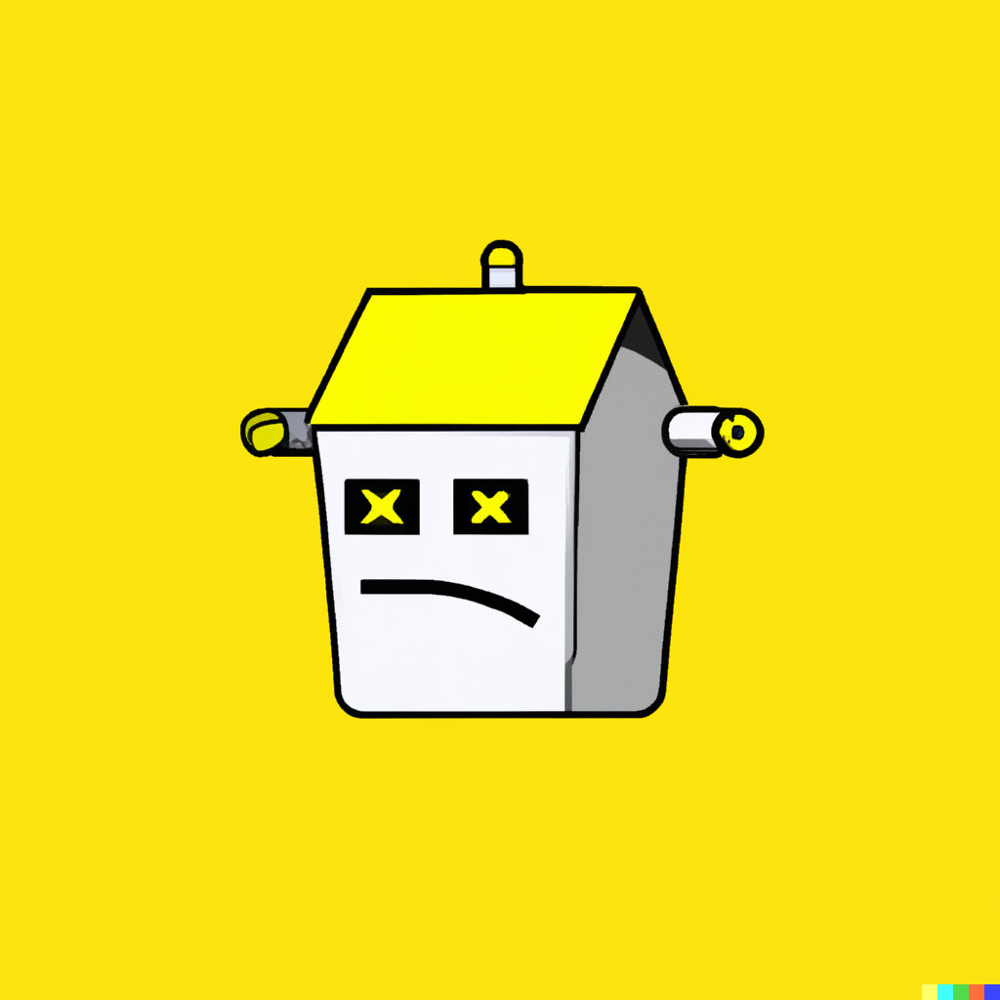

<h1 align="center">
   
  
   
    Seek
   
</h1>

<h4 align="center">O Seek é um projeto de web scraping sendo desenvolvido para fornecer informações imobiliárias úteis</h4>

  <a href="#caracteristicas">Caracteristicas</a> •
  <a href="#agradecimentos">Agradecimentos</a> •
  <a href="#relacionado">Relacionado</a> •
  <a href="#license">License</a>

## caracteristicas

* LivePreview - Make changes, See changes
  - Instantly see what your Markdown documents look like in HTML as you create them.
* Sync Scrolling
  - While you type, LivePreview will automatically scroll to the current location you're editing.
* GitHub Flavored Markdown  
* Syntax highlighting
* [KaTeX](https://khan.github.io/KaTeX/) Support
* Dark/Light mode
* Toolbar for basic Markdown formatting
* Supports multiple cursors
* Save the Markdown preview as PDF
* Emoji support in preview :tada:
* App will keep alive in tray for quick usage
* Full screen mode
  - Write distraction free.
* Cross platform
  - Windows, macOS and Linux ready.

## agradecimentos

This software uses the following open source packages:

- [Electron](http://electron.atom.io/)
- [Node.js](https://nodejs.org/)
- [Marked - a markdown parser](https://github.com/chjj/marked)
- [showdown](http://showdownjs.github.io/showdown/)
- [CodeMirror](http://codemirror.net/)
- Emojis are taken from [here](https://github.com/arvida/emoji-cheat-sheet.com)
- [highlight.js](https://highlightjs.org/)

## relacionado

[markdownify-web](https://github.com/amitmerchant1990/markdownify-web) - Web version of Markdownify

## Support

Or
 

## You may also like...

- [Pomolectron](https://github.com/amitmerchant1990/pomolectron) - A pomodoro app
- [Correo](https://github.com/amitmerchant1990/correo) - A menubar/taskbar Gmail App for Windows and macOS

## License

MIT

---

> [amitmerchant.com](https://www.amitmerchant.com) &nbsp;&middot;&nbsp;
> GitHub [@amitmerchant1990](https://github.com/amitmerchant1990) &nbsp;&middot;&nbsp;
> Twitter [@amit_merchant](https://twitter.com/amit_merchant)

